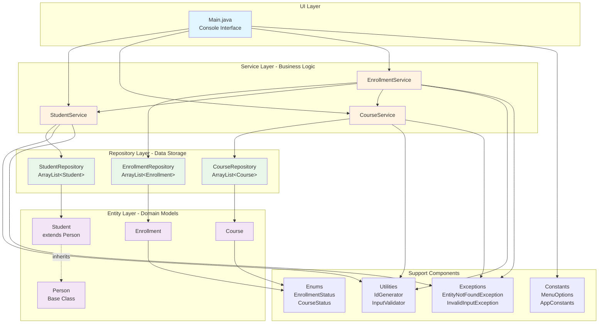

# LearnTrack Architecture Diagram

This diagram shows the layered architecture of the LearnTrack application.

## Layer Descriptions

### UI Layer
- **Main.java**: Entry point and console interface for user interaction
- Handles menu display and user input
- Delegates business logic to service layer

### Service Layer
- **StudentService**: Business logic for student management
- **CourseService**: Business logic for course management
- **EnrollmentService**: Business logic for enrollment management
- Validates input and coordinates between repositories

### Repository Layer
- **StudentRepository**: In-memory storage for students using ArrayList
- **CourseRepository**: In-memory storage for courses using ArrayList
- **EnrollmentRepository**: In-memory storage for enrollments using ArrayList
- Handles CRUD operations

### Entity Layer
- **Person**: Base class with common attributes
- **Student**: Extends Person, represents a student
- **Course**: Represents a course
- **Enrollment**: Links students to courses

### Support Components
- **Utilities**: Helper classes (IdGenerator, InputValidator)
- **Constants**: Application constants (MenuOptions, AppConstants)
- **Enums**: Status enumerations (EnrollmentStatus, CourseStatus)
- **Exceptions**: Custom exceptions for error handling

