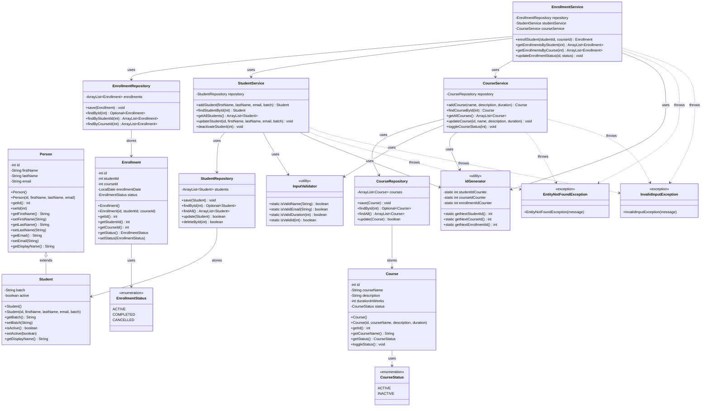

# LearnTrack Class Diagram

This diagram shows the class relationships and structure in the LearnTrack application.

## Class Descriptions

### Entity Layer

#### Person (Base Class)
- Abstract representation of a person
- Contains common attributes: id, firstName, lastName, email
- Provides base implementation of `getDisplayName()`

#### Student (Extends Person)
- Represents a student in the system
- Adds student-specific fields: batch, active status
- Overrides `getDisplayName()` to include batch information

#### Course
- Represents a course offering
- Contains course details: name, description, duration
- Has a status (ACTIVE/INACTIVE)

#### Enrollment
- Links a student to a course
- Tracks enrollment date and status
- Represents the many-to-many relationship between students and courses

### Repository Layer

#### StudentRepository
- Manages in-memory storage of students using ArrayList
- Provides CRUD operations for Student entities
- Returns Optional for safe null handling

#### CourseRepository
- Manages in-memory storage of courses using ArrayList
- Provides CRUD operations for Course entities

#### EnrollmentRepository
- Manages in-memory storage of enrollments using ArrayList
- Provides specialized queries (by student, by course)
- Checks for duplicate enrollments

### Service Layer

#### StudentService
- Business logic for student management
- Validates input before creating/updating students
- Uses StudentRepository for data access
- Throws custom exceptions for error cases

#### CourseService
- Business logic for course management
- Validates course data
- Manages course status transitions

#### EnrollmentService
- Business logic for enrollment management
- Coordinates between StudentService and CourseService
- Validates that students and courses exist before enrollment
- Prevents duplicate enrollments

### Utility Classes

#### IdGenerator
- Static utility for generating unique IDs
- Maintains separate counters for students, courses, and enrollments
- Thread-safe for single-threaded applications

#### InputValidator
- Static utility for input validation
- Validates names, emails, durations, and IDs
- Centralizes validation logic

### Exception Classes

#### EntityNotFoundException
- Thrown when a requested entity (Student, Course, Enrollment) is not found
- Extends Exception (checked exception)

#### InvalidInputException
- Thrown when user input fails validation
- Extends Exception (checked exception)

## Key Design Patterns

1. **Repository Pattern**: Separates data access from business logic
2. **Service Layer Pattern**: Encapsulates business logic
3. **Inheritance**: Student extends Person
4. **Encapsulation**: Private fields with public accessors
5. **Static Utility Pattern**: IdGenerator and InputValidator

