# OOP Concepts in LearnTrack

This diagram illustrates the key Object-Oriented Programming concepts demonstrated in the LearnTrack project.

```mermaid
graph TB
    subgraph "Inheritance"
        P[Person<br/>- id<br/>- firstName<br/>- lastName<br/>- email<br/>+ getDisplayName]
        S[Student<br/>- batch<br/>- active<br/>+ getDisplayName override]
        P -->|extends| S
    end
    
    subgraph "Encapsulation"
        E1[Private Fields<br/>- id<br/>- firstName<br/>- lastName]
        E2[Public Methods<br/>+ getId<br/>+ setId<br/>+ getFirstName<br/>+ setFirstName]
        E1 -.protected by.-> E2
    end
    
    subgraph "Polymorphism"
        PM1[Person.getDisplayName<br/>returns: firstName + lastName]
        PM2[Student.getDisplayName<br/>returns: firstName + lastName + batch]
        PM1 -.overridden by.-> PM2
    end
    
    subgraph "Static Members"
        ST1[IdGenerator<br/>static int studentIdCounter<br/>static int courseIdCounter]
        ST2[static getNextStudentId<br/>static getNextCourseId]
        ST1 --> ST2
    end
    
    subgraph "Exception Handling"
        EX1[Custom Exceptions]
        EX2[EntityNotFoundException]
        EX3[InvalidInputException]
        EX1 --> EX2
        EX1 --> EX3
    end
    
    subgraph "Collections"
        C1[ArrayList&lt;Student&gt;]
        C2[ArrayList&lt;Course&gt;]
        C3[ArrayList&lt;Enrollment&gt;]
        C1 -.dynamic storage.-> C2
        C2 -.dynamic storage.-> C3
    end
    
    style P fill:#e1bee7
    style S fill:#ce93d8
    style E1 fill:#ffccbc
    style E2 fill:#ff8a65
    style PM1 fill:#c5e1a5
    style PM2 fill:#9ccc65
    style ST1 fill:#b3e5fc
    style ST2 fill:#4fc3f7
    style EX1 fill:#fff9c4
    style EX2 fill:#fff59d
    style EX3 fill:#fff59d
    style C1 fill:#f8bbd0
    style C2 fill:#f48fb1
    style C3 fill:#f06292
```



## OOP Concepts Explained

### 1. Inheritance
- **Person** is the base class with common attributes (id, firstName, lastName, email)
- **Student** extends Person and adds student-specific fields (batch, active)
- Demonstrates the "IS-A" relationship: A Student IS-A Person
- Uses `super` keyword to call parent constructor

### 2. Encapsulation
- All entity fields are declared as **private**
- Access to fields is controlled through **public getter and setter methods**
- Protects internal state from unauthorized access
- Allows validation in setters before modifying data

### 3. Polymorphism
- **Method Overriding**: Student overrides Person's `getDisplayName()` method
- Person returns: "John Doe"
- Student returns: "John Doe (Batch: 2024)"
- Same method name, different behavior based on object type

### 4. Static Members
- **IdGenerator** uses static fields to maintain counters across the application
- Static methods can be called without creating an object
- Shared state: All parts of the application use the same ID counters
- Example: `IdGenerator.getNextStudentId()` - no object needed

### 5. Exception Handling
- **Custom Exceptions** for domain-specific errors
- **EntityNotFoundException**: Thrown when a student/course/enrollment is not found
- **InvalidInputException**: Thrown when validation fails
- Provides meaningful error messages to users

### 6. Collections (ArrayList)
- **Dynamic sizing**: No need to specify size upfront
- **Type safety**: `ArrayList<Student>` only stores Student objects
- **Rich API**: Built-in methods for add, remove, search, etc.
- Preferred over arrays for flexibility and ease of use

## Code Examples

### Inheritance Example
```java
// Base class
public class Person {
    private int id;
    private String firstName;
    
    public String getDisplayName() {
        return firstName + " " + lastName;
    }
}

// Derived class
public class Student extends Person {
    private String batch;
    
    @Override
    public String getDisplayName() {
        return super.getDisplayName() + " (Batch: " + batch + ")";
    }
}
```

### Encapsulation Example
```java
public class Student {
    private int id;  // Private field
    
    // Public getter
    public int getId() {
        return id;
    }
    
    // Public setter with validation
    public void setId(int id) {
        if (id > 0) {
            this.id = id;
        }
    }
}
```

### Static Members Example
```java
public class IdGenerator {
    private static int studentIdCounter = 1000;
    
    public static int getNextStudentId() {
        return ++studentIdCounter;
    }
}

// Usage (no object needed)
int newId = IdGenerator.getNextStudentId();
```

### Exception Handling Example
```java
try {
    Student student = studentService.findStudentById(id);
    System.out.println(student);
} catch (EntityNotFoundException e) {
    System.out.println("Error: " + e.getMessage());
} catch (InvalidInputException e) {
    System.out.println("Validation Error: " + e.getMessage());
}
```

